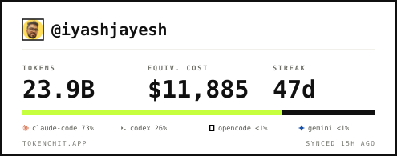
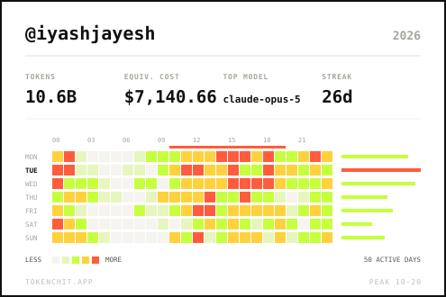

# tokenchit

Turn your local AI coding agent logs into an embeddable stat card for your GitHub README.

tokenchit reads the transcripts **Claude Code**, **Codex** and **OpenCode** already write to
your disk, totals them, and renders an SVG you commit to your own repo. No account, no
upload, no server — the card is a file.

```bash
npx @tokenchit/cli init     # detect agents, write .tokenchit.json
npx @tokenchit/cli sync     # render tokenchit.svg
npx @tokenchit/cli recap    # render tokenchit-recap.svg — the year in review
```

```markdown


```

## What it reads

| Agent | Source |
| --- | --- |
| Claude Code | `~/.claude/projects/**/*.jsonl` |
| Codex | `~/.codex/sessions/**/rollout-*.jsonl` |
| OpenCode | `~/.local/share/opencode/opencode.db` |

All Claude Code configuration directories are read, not just `~/.claude`. Anyone with more
than one account has several — `~/.claude-work`, `~/.claude-personal` and so on — and reading
only the first silently omitted most of the usage. `CLAUDE_CONFIG_DIR` is added to that scan
rather than replacing it: it names the directory the *current* session uses, which is a
different question from where all your usage lives.

### Why the total differs from Claude Code's Stats panel

Expect Claude Code's panel to read roughly twice as high. Two separate things cause that,
and only one of them is a limitation on this side.

**The Stats panel counts each API call once per streaming rewrite.** Claude Code rewrites an
assistant message in the transcript as it streams, so one call leaves several `usage` records
carrying the same growing figures. `stats-cache.json` sums them as written. On one machine,
51,373 usage records represented 23,644 real API calls, and the cache matched the naive sum of
all 51,373 to the exact token on 28 of 57 days — and matched the deduplicated total on none.

tokenchit collapses those to one row per call. That is safe to do: every message id observed
more than once carried exactly one `requestId`, without exception, and deduplicating by
`message.id` and by `requestId` independently agreed to within 0.002%. Counting them again
would invent tokens nobody was billed for.

**Claude Code also deletes old transcripts.** The Stats panel keeps reading the cumulative
cache after the underlying transcripts are gone, so it covers a longer period than any
transcript parser can see. On the same machine the cache reached back to June while the
oldest surviving transcript was early July.

That second one is a real limitation, not a bug: a number derived from logs cannot include
logs that no longer exist. The cache is not a usable substitute, because it carries the
inflation described above and the factor varies day to day — between 1.15x and 2.18x on the
days measured — so there is no constant to divide out.

**Copilot CLI and Gemini CLI are detected but cannot be counted.** Copilot records only a
live context-window gauge, never a cumulative total; Gemini's chat transcripts carry no token
counts at all. `init` says so out loud rather than silently omitting them — if either starts
writing usage, they become adapters.

Nothing but token counts, model ids and timestamps is read. No prompts, no completions, no
file contents, no paths leave the aggregation.

## Equivalent API cost is not spend

The dollar figure is **what your tokens would cost at list API rates** — not what you paid.
Most agent usage runs under a subscription where no per-token charge ever happens. Models
with no public price (bundled or self-hosted ones) are counted in the token total and left
out of the cost, and `sync` tells you what share of tokens the figure actually covers:

```
! Cost covers 99.6% of tokens — no public price for: qwen3-coder-next, big-pickle
```

Prices are vendored from [LiteLLM](https://github.com/BerriAI/litellm) and refreshed by a
maintainer with `node packages/core/scripts/refresh-prices.mjs`. The CLI itself never makes
a network request.

## Commands

One command does the lot:

```bash
npx @tokenchit/cli@latest generate
```

It detects your agents, shows your stats, writes the card, and puts you on the board — each
step announced before it happens. `--no-publish` stops after the card.

The steps are also commands in their own right, and `generate` is a composition of exactly
those, so running them separately does identical work. `sync` shows you everything before
anything leaves the machine.

```
tokenchit generate       the whole flow, below, in order
  --no-publish           stop after writing the card

tokenchit init           say who you are
  --handle <name>        GitHub handle (default: guessed from your origin remote)

tokenchit sync           read your logs, show your stats, write the card
  --out <path>           where to write it (default: tokenchit.svg)
  --layout default|compact
  --theme auto|light|dark
  --json                 print the aggregate instead of writing an SVG
  --dry-run              report what would be written, write nothing

tokenchit publish        put your row on the public board
  --anonymous            publish without signing in; the row is marked unverified
  --dry-run              print the exact bytes and send nothing
  --api <url>            default https://tokenchit.vercel.app
  --handle <name>

tokenchit recap
  --out <path>           default: tokenchit-recap.svg
  --year <yyyy>          label the recap with a different year
  --theme auto|light|dark
  --json                 print the recap model instead of writing an SVG
  --dry-run

tokenchit schedule       print a cron or launchd entry; installs nothing
  --every daily|hourly   how often to publish (default: daily)
  --cron                 force a crontab line even on macOS

tokenchit login          prove your GitHub handle (device flow, no password)
tokenchit logout         forget this machine
tokenchit whoami         who this machine is signed in as
```

`tokenchit help <command>` explains one command on its own. `NO_COLOR=1` drops colour and
animation.

`publish` signs you in on the way through, so `login` is rarely needed on its own — an
unverified row is seldom what anyone wants, and being told to go and run another command
first is how people end up with one. That only happens at a terminal: in CI or a cron job
nobody can read a device code, so it publishes unverified rather than hanging. `--anonymous`
is the same choice made deliberately.

### Keeping a row current

Publishing is not automatic, and it cannot be made automatic anywhere but this machine: the
logs are local and exist nowhere else, so a GitHub Action has nothing to read. `tokenchit
schedule` prints a launchd or cron entry that runs `publish` on a timer.

It prints and stops. Installing a background job that survives reboots and keeps sending data
is not something to do on someone's behalf because they typed a word that sounded convenient.

## The recap

`recap` renders a weekday-by-hour heatmap of when you actually work, alongside your totals,
top model and streak — in the terminal and as a second committable SVG:

```
       00    06    12    18
  MON  ▓▓     ░░▓▒░▓▓▒▒█▓▓▒░▒▓▒   71%
  TUE  ▒▒░░  ░░ ░░█████▓▓█▓░      86%
  WED  ░░        ░██▓░████▒░  ░   89%
  SUN  ███▓░     █▓█▒▓█ ▒▒█▒▒▒▓  100%

  peak 11:00-20:00  ·  37 active days
```

Cells are coloured by **rank across the distinct values**, the way GitHub's contribution
graph works, not by magnitude. Token counts are violently skewed — one long session can hold
more than a quiet week — so a linear scale paints a single square hot and leaves the rest
indistinguishable.

Codex only records a running total per session, so its hours land on the session's last
turn. Claude Code and OpenCode are exact to the message.

`sync` writes the SVG and stops — committing on your behalf is your call, not the tool's.

## Publishing to the board

`publish` is the **only** command that sends anything anywhere. `sync` and `recap` are local
forever, and there is deliberately no config switch to change that: `.tokenchit.json` is a
committed file, and a committed file must never be able to cause a network call on somebody
else's machine.

`--dry-run` prints the exact bytes that would be uploaded — the same string, not a rendering
of it, which `dryrun.exact` in the test suite enforces by comparing against what a real
publish puts on the wire. The payload is aggregates only: totals, per-day token counts, agent
and model ids. No prompts, no replies, no branch names, no paths.

## Signing in

```
$ tokenchit login
  Open https://github.com/login/device
  and enter  WDJB-MJHT
✓ signed in as @octocat
```

GitHub's **device flow** — no password, no token to paste, and no localhost callback server,
which matters because the usual OAuth-in-a-CLI approach breaks over SSH, in containers and on
remote dev boxes: exactly where people run coding agents.

**No scopes are requested.** GitHub answers `GET /user` for an unscoped token, and your login
and numeric id are all we need.

The GitHub token is handed to the server **once**, so that the server — not the client — is
what asks GitHub who you are; a client that simply asserted `{"handle": "octocat"}` would be
forgeable. It is then discarded, never written to disk on either side. What you keep is a
tokenchit API key in `~/.config/tokenchit/auth.json`, mode `0600`, stored server-side only as
a SHA-256 hash. Never in `.tokenchit.json`, which is committed.

Without signing in, submissions land as the unverified `cli` tier. Those rows appear on the
board with a badge rather than being hidden — a transparency signal, not a gate. Signing in
upgrades the handle to `verified`, and takes it over from any unverified row that claimed it
first.

### Running the board locally

The board runs against Supabase — there is no local database to start.

```bash
cp apps/site/.env.example apps/site/.env.local   # then fill in the password
npm run db:migrate                               # idempotent; safe to re-run
npm run dev

npx @tokenchit/cli login   --api http://localhost:3000
npx @tokenchit/cli publish --api http://localhost:3000
```

`.env.local` is gitignored; `apps/site/.env.example` documents the shape. Next reads
`.env.local` automatically and the migration runner reads the same file, so the site and the
migrations cannot end up pointing at different databases.

**Use the shared (transaction) pooler on port 6543, not the direct connection on 5432.**
Serverless functions open a connection per invocation and exhaust a direct connection limit
quickly; Supavisor exists for exactly that. The pool in `apps/site/lib/db.ts` is capped at 5
to match.

### Rate limits

Writes are limited per hour, in Postgres rather than in memory — serverless functions share
no memory, so an in-process counter would reset on every cold start and count separately per
instance.

| bucket | limit |
| --- | --- |
| anonymous publish, per IP | 10/h |
| signed-in publish, per user | 60/h |
| publish, per handle | 30/h |
| sign-in, per IP | 20/h |
| board reads, per IP | 300/h |

Signed-in callers get more headroom than anonymous ones: they have proved who they are and
their rows carry their name. The per-handle bucket exists because the per-IP one alone is
defeated by spreading requests across addresses.

Every response carries `x-ratelimit-limit` and `x-ratelimit-remaining`, refusals add
`retry-after`, and the CLI prints the wait rather than a bare status code.

### Notes on the database

- **`003_rls.sql` is not optional on Supabase.** Supabase exposes every `public` table
  through PostgREST using the anon key, which is public by design. Without row level security
  enabled, that key would read `api_tokens` and the entire submissions history. The migration
  enables RLS with no policies, which closes that surface completely and changes nothing for
  our server, which connects directly as the table owner.
- **Free Supabase projects pause after 7 days of low activity** and need a human to click
  *Resume* in the dashboard, with a 90-day window before the backup expires. A few requests a
  day avoids it, so it bites a quiet project rather than a busy one. That is why
  [`docs/research.md`](./docs/research.md) §4 prefers Neon, whose idle behaviour is
  scale-to-zero with automatic resume.
- Migrations are plain SQL in `apps/site/db/migrations/`, applied in filename order and
  tracked in a `_migrations` table. There is no local Postgres: a contributor who only needs
  the CLI or the card never touches a database, and `npm test` requires none.

## The site

| route | what it is |
| --- | --- |
| `/` | the pitch, with a live card preview and a board teaser |
| `/board` | the full ranking, with headline totals, over any of four windows |
| `/u/<handle>` | one developer: contribution graph, agent split, model breakdown, their card |
| `/api/card/<handle>.svg` | the card endpoint |
| `/api/submissions` | publish (POST) and read the board (GET) |

Every column on the board and the profile is summed over the same window, which is why
`user_days` carries an agent and a cost per day. Streak is the exception and is not windowed:
it is a current-streak count, and "your streak, but only counting last week" is not a thing
anyone means.

Profile pages are shareable, so they carry a PNG `og:image` rendered from the same figures —
`og:image` is deliberately **not** set in `generateMetadata`, because doing so overrides the
file-based `opengraph-image` convention and the page would then advertise the SVG card, which
Twitter, Slack and Facebook all decline to render.

## Releasing

CI runs on every pull request: build and tests on Node 22 **and** 24 (the OpenCode adapter
uses `node:sqlite`, experimental on 22 and stable on 24 — the place they are most likely to
disagree), plus lint, the standalone site build Vercel performs, and an install of the packed
tarballs, because the tarball is a different artifact from the working tree.

**One published package.** `@tokenchit/core` stays a workspace package — it is what keeps
the site and the CLI rendering the same card — but it is `private` and esbuild inlines it
into the CLI's single bundled file. Publishing a second package would mean maintaining a
public API surface nobody has asked for, and every rename inside it would become a
compatibility decision for strangers. Publishing core later is easy; unpublishing is not.

**Publishing is version-driven.** The release workflow runs on every push to `main` but
publishes only when `packages/cli/package.json` names a version npm does not already have.
Bumping the version is the release:

```bash
npm run version:set 0.2.0   # both packages, and the dependency between them
npm install
git commit -am "Release v0.2.0"
git push
```

CI then builds, tests, lints, creates the `v0.2.0` tag and publishes. Merging anything that
leaves the version field alone publishes nothing, which is most merges — docs, the site, a
dependency bump.

This keeps what a tag-only trigger was protecting. An unpublished npm name can never be
reused by anyone, so releasing has to be deliberate; it is now an explicit edit to a version
field rather than an explicit tag. What it removes is the failure mode where the bump lands
and the tag never gets pushed, so a fix sits on `main` for a week believing it shipped.

The registry, not the tag, is the source of truth: the workflow asks npm whether that exact
version exists, so a re-run, a revert, or a manually pushed tag all stop quietly instead of
failing over work already done. Tests run before the tag is created, because a tag pointing
at a commit that does not build is worse than no tag.

It attaches npm provenance so the package carries a signed link back to the commit that
produced it. CI
installs the packed tarball into an empty project on every pull request and asserts nothing
but `@tokenchit/cli` lands, which is what stops the bundle silently regressing into a broken
dependency on the private package.

Requires an `NPM_TOKEN` repository secret with publish rights.

## Repo layout

```
apps/site/          Next.js marketing site + the board API
packages/core/      adapters, aggregation, price table, SVG builder
packages/cli/       the tokenchit binary
docs/research.md    positioning, competitive landscape, infrastructure decisions
```

The site and the CLI render through the same `buildCardSvg()`, so they cannot drift.

```bash
npm install
npm run build     # core, then cli, then site
npm test          # adapter and aggregation tests
npm run dev       # the site at http://localhost:3000
```

Requires Node 22 or newer — OpenCode support uses the built-in `node:sqlite`.

## The hosted endpoint

`apps/site` also serves `GET /api/card/<handle>.svg` with `layout`, `theme`, `agents`, `hide`
and `cache` parameters. It renders sample data and exists to demonstrate the builder. The
supported path is the committed SVG: it costs nothing to run, cannot be abused, and — unlike
an external image — GitHub serves it directly rather than through its camo proxy.

Measured on a live public repository rather than assumed:

| in a README | rendered as | proxied |
| --- | --- | --- |
| committed SVG, relative `./card.svg` | `/owner/repo/raw/main/card.svg` | no |
| committed SVG, absolute `raw.githubusercontent.com` | unchanged | no |
| any external image | `camo.githubusercontent.com/…` | yes |
| this project's own `/api/card/…` endpoint | `camo.githubusercontent.com/…` | yes |

Both committed forms work, so `sync` printing a relative path costs nothing. The `<style>`
block survives too — a committed `theme=auto` card really does follow GitHub's dark mode,
which the original design brief assumed was impossible.

## Design and research

Built from the design handoff in [`design_handoff_tokencard_site/`](./design_handoff_tokencard_site).
Positioning, the competitive landscape and infrastructure decisions are researched and cited
in [`docs/research.md`](./docs/research.md).

Site conventions: border radius is 0 everywhere, shadows are hard offsets only, there are no
media queries, and the blinking `▌` after the install command is the only animation.

## Not built, deliberately

Spend-based tier ladders, pricing, a blog, a site dark-mode toggle, and scheduled-Action
automation.

**A browser session, deliberately.** Sign-in happens in the terminal, and nothing on the site
is per-user — no settings, no upload form, no private page. Identity exists to stamp a row on
the board, and only the CLI can produce a row. Adding browser OAuth would mean GitHub's web
flow, which is the one flow that needs a client secret, in exchange for a header pill.
